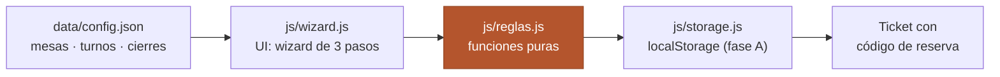

# La Mesa del Bío Bío — Sistema de Reservas

Wizard de reservas para un restaurante ficticio de Concepción, montado sobre
un motor de reglas de negocio testeado. JavaScript vanilla, sin frameworks
ni build.

**[Sitio en vivo](https://migueltapiaurrutia.github.io/reservas-restaurante/)** ·
**[Suite de tests en vivo](https://migueltapiaurrutia.github.io/reservas-restaurante/tests.html)**
— 26 tests del motor de reglas, públicos: cualquiera puede verlos pasar.

**Estado:** ✅ Fase A completada · Fase B (backend + VPS) planificada

## Arquitectura



`js/reglas.js` es el núcleo y no depende de nada del navegador: ni DOM, ni
storage, ni `new Date()` interno — la fecha de hoy, la configuración y las
reservas existentes entran por parámetros. La UI le pregunta; nunca decide.

## Funcionalidades

- **Wizard de 3 pasos** (¿cuándo? → ¿cuántos? → tus datos) con validación
  temprana: cada paso valida lo suyo antes de dejar avanzar.
- **Asignación best-fit de mesas**: a cada grupo, la mesa más chica cuya
  capacidad alcance.
- **Detección de colisiones**: una mesa, una reserva por fecha y turno
  (almuerzo y cena del mismo día no chocan).
- **Ticket de confirmación** con código corto legible (6 caracteres, sin
  0/O ni 1/I/L) y verificación final contra las reglas antes de guardar.
- **Modo demo** ([`?demo=1`](https://migueltapiaurrutia.github.io/reservas-restaurante/?demo=1)):
  siembra reservas ficticias —con un turno casi lleno a propósito— para
  presentar el rechazo por falta de mesa. Nunca pisa datos existentes.

## Decisiones técnicas

- **Reglas como funciones puras**: misma entrada → misma salida. Se testean
  sin navegador y sin mocks; los tests fijan su propio "hoy".
- **Validar lo antes posible**: la fecha se rechaza en el paso 1, no al
  confirmar. Nadie debería escribir su teléfono para recién ahí enterarse
  de que el restaurante cierra los lunes.
- **Una aserción, un comportamiento** en los tests: cuando algo falla, el
  nombre del test dice exactamente qué se rompió.
- **El color nunca es el único portador de significado** (WCAG 1.4.1):
  éxito, error y aviso llevan siempre icono + texto.
- **Mesa más chica suficiente = eficiencia de ocupación**: si un grupo de 2
  se sentara en la mesa de 8, esa noche se rechazaría al grupo de 8 aunque
  sobraran mesas chicas.

## Arquitectura preparada para backend

`js/storage.js` es la única pieza que cambia en la fase B (Node/Express en
un VPS): su interfaz son dos funciones, `cargarReservas` y `guardarReservas`,
y el resto de la app no sabe dónde viven los datos. El día del cambio, solo
se reemplaza el cuerpo de esas funciones por llamadas a la API.

Las reglas viajarán al servidor **tal cual**: al ser JS puro sin DOM ni
localStorage, el mismo `reglas.js` que hoy corre en el navegador correrá en
Node validando reservas del lado correcto de la red.

## Limitaciones conocidas

- **localStorage = reservas por navegador**: cada visitante ve solo las
  suyas. Suficiente para una demo; insuficiente para un restaurante real,
  donde todas las reservas deben vivir en un solo lugar. Esa es exactamente
  la razón de la fase B.
- **Sin edición ni cancelación de reservas**: mejora futura, junto al mapa
  visual de mesas.

## Correr en local

```
npx serve          # el wizard carga data/config.json por fetch
```

Los tests no necesitan servidor: abrir `tests.html` directo en el navegador.
Cada test se pinta en verde o rojo y al final aparece "X de Y tests pasando".
